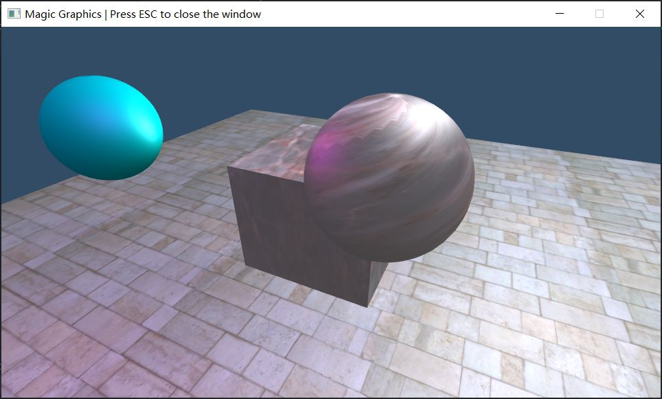

# My-Learn-OpenGL
早期作品，学习OpenGL和着色器，内容较少。最初用Visual Studio编写，临时写了个CMake配置。

## Features
+ glfw3 + glad
+ Application interface
+ 3D Math
+ Phong pipeline
+ Multiple light
+ Sphere mesh generation (自己想的)

## Build
For vcpkg, use `-DCMAKE_TOOLCHAIN_FILE=path/to/vcpkg/scripts/buildsystems/vcpkg.cmake` when config cmake.

.vscode/settings.json template:
```json
{
    "cmake.configureArgs": [
        "-DCMAKE_TOOLCHAIN_FILE=path/to/vcpkg/scripts/buildsystems/vcpkg.cmake"
    ],
    "C_Cpp.default.configurationProvider": "ms-vscode.cmake-tools"
}
```

The executable working directory should contain 'Assets' folder.

Use C++20 concepts.

## Screenshot

